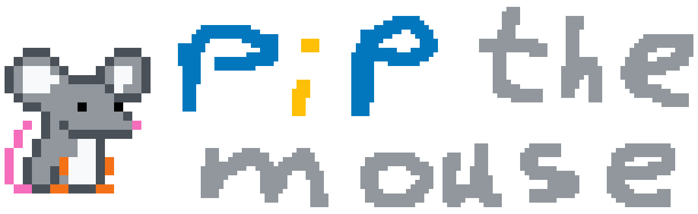
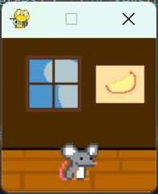
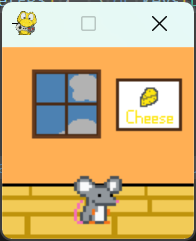
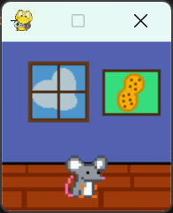
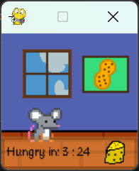
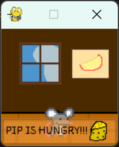

#  Your small mouse friend written in Python! (Made for Hackapet) 
Pip the Mouse is a small game/pet written for your Hackapet! You can watch him sleep, feed him, ... If something goes wrong he'll start to climb walls so, watch out for that...  

# Wait what
You heard me right! Pip is built for the hackapet, dunno what that is? Go here -> [Hackapet](https://hackapet.hackclub.dev/)  
Pip was written using circuitPython, which is why he's named pip. Ya know, the python package installer, anyways.  

# Game Functions
- Feeding Pip an assortment of foods! (cheese, peanuts, apple slices, grapes)
- If he's bored he'll start to sleep
- Very important! If you feed him too much (or too little) he'll uhhh <sub>die</sub> ...

# Game Controls
**PC:**
 - Left Arrow: Open GUI
 - Up Arrow: Drop food
 - Down Arrow: Wake up when sleeping
  
**Hackapet:**
- I'll add support when I get one...

# Playing it
Oh! You want to play the game! Sure, here are some instructions:
- Download the repo as a zip
- Optionally, if you feel like arraging stuff, make a virtual enviroment in Python using these commands:
```
python3 -m venv .env
source .env/bin/activate
```
- Next, install the necessary libraries using pip (see what I did there)
```
pip3 install blinka-displayio-pygamedisplay adafruit-circuitpython-display-text
```
- Now run main.py while you're in your venv and you should be good to go!

# Some screenshots





